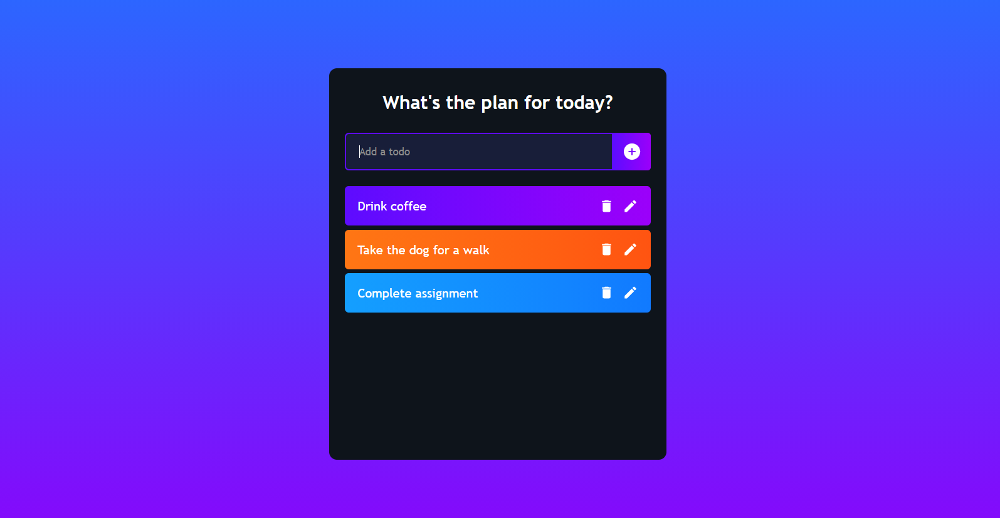

# To-Do list app

A simple todo list app built using ReactJS.

 

### Running the app: 
1. Clone the project repo

        git clone https://github.com/sourhub226/todo-list-react.git
 
2. Move to root directory of the project 

        cd todo-list-react
        
3. Install all required npm packages

        npm install
    
4. Run the app

        npm start

This project was bootstrapped with [Create React App](https://github.com/facebook/create-react-app).
